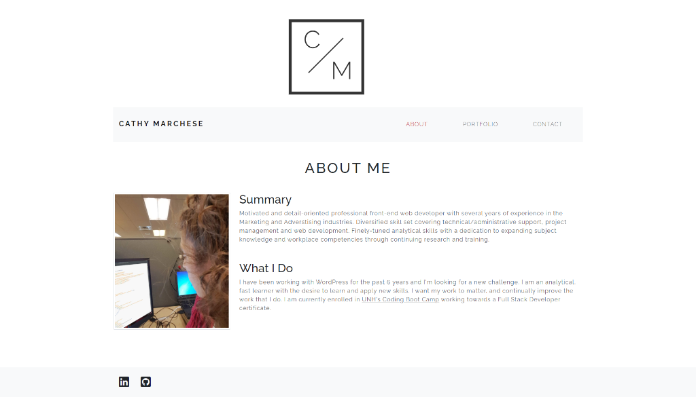

# Bootstrap-Responsive-Portfolio

## Description 

Create a responsive portfolio using the Bootstrap CSS Framework incorporating its grid system, components (such as navbar and responsive images) and custom classes.

## Screenshot

## URL

https://crrmarchese.github.io/Bootstrap-Responsive-Portfolio/
